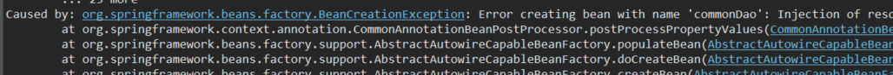
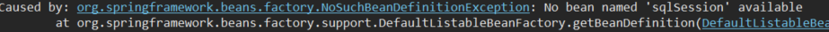

### 1. 단위테스트

> 기본 단위테스트

```java
@Test
	public void monthBeteween() {
		try {
			String start_dt = "20220910";
			String end_dt = "20221209";

			DateFormat format = new SimpleDateFormat("yyyyMMdd");

			Date day1 = format.parse(start_dt);
			Date day2 = format.parse(end_dt);

			long Days = (day2.getTime() - day1.getTime()) / (24 * 60 * 60 * 1000); // 일

			System.out.println(Days / 30); // 월
		} catch (ParseException e) {
			e.printStackTrace();
		}
	}

	@Test
	public void dateCalc() {
		try {
			String start_dt = "20220910";
			String end_dt = "20221209";

			SimpleDateFormat sdf = new SimpleDateFormat("yyyyMMdd");

			Date day1 = sdf.parse(start_dt);
			Calendar cal = Calendar.getInstance();
			cal.setTime(day1);

			cal.add(Calendar.MONTH, 12); // 12개월 더하기


			System.out.println(sdf.format(cal.getTime()));
		} catch (ParseException e) {
			e.printStackTrace();
		}
	}
```

> 통합단위테스트

```java
@RunWith(SpringJUnit4ClassRunner.class)
/*
단위테스트에서는 bean 파일을 못 읽기 때문에 bean 을 강제주입 해줘야 함
@ContextConfiguration 해당 어노테이션을 통해 bean 이 설정 되어 있는 파일경로를 지정해주어야 함.
*/ 
@ContextConfiguration(locations = {"classpath*:config/spring/context-*.xml"})

 ...
 
	@Autowired
	CommonDao dao;
  
	@Test
	public void connectDb() {
		Map<String, Object> dsParam = new HashMap<String,Object>();
		dsParam.put("jbfmDivCd", "2");
		List<Map<String,Object>> list = dao.selectList("AhrmbsQry.findEmpPopList", dsParam);
	}
```

이렇게 @RunWith, @ContextConfiguration 두개의 어노테이션만 해주면 아래와 같은 오류가 계속 발생.




계속 해서 bean 을 못 찾는 오류가 발생.
> 원인 : bean 설정 파일 안에 <beans></beans> 로 여러개의 bean profile 이 설정되어 있었음.

```java
<beans>
 	<bean profile = "local">
	...
	</bean>
	
 	<bean profile = "dev">
	...
	</bean>
	...
</beans>
```

그래서 @ActiveProfiles("local") 어노테이션을 붙여줌으로써 local 의 bean을 주입하여 정상적으로 통합테스트 실행됨.
```java
@RunWith(SpringJUnit4ClassRunner.class)
@ContextConfiguration(locations = {"classpath*:config/spring/context-*.xml"})
@ActiveProfiles("local") // 해당 어노테이션이 중요했음.
 ...
 
	@Autowired
	CommonDao dao;
  
	@Test
	public void connectDb() {
		Map<String, Object> dsParam = new HashMap<String,Object>();
		dsParam.put("jbfmDivCd", "2");
		List<Map<String,Object>> list = dao.selectList("AhrmbsQry.findEmpPopList", dsParam);
	}
```
